<div align="center">

<a href="https://vignesh2027.github.io/GitHub-Repo-Analyzer/">
  
</a>

<br/>


<br/><br/>

[](https://vignesh2027.github.io/GitHub-Repo-Analyzer/)
[](https://github.com/vignesh2027/GitHub-Repo-Analyzer/stargazers)
[](https://github.com/vignesh2027/GitHub-Repo-Analyzer/network)
[](LICENSE)

[](https://fastapi.tiangolo.com)
[](https://react.dev)
[](https://tailwindcss.com)
[](https://railway.app)
[](https://pages.github.com)

</div>

---

<div align="center">

## 🎬 See It In Action



</div>

---

<div align="center">

## ✨ 10 Powerful Features



</div>

---

## 🚀 What Makes RepoLens Different

> Paste any GitHub URL. Get an instant, beautiful intelligence report — no sign-up, no friction, no noise.

<table>
<tr>
<td width="50%">

### 🏥 Repository Health Score
A **0–100 score** computed across 7 quality dimensions with a letter grade (A/B/C/D). Understand at a glance whether a project is production-ready.

| Dimension | Weight |
|---|---|
| README quality | 20 pts |
| Commit activity | 20 pts |
| Test coverage detection | 15 pts |
| CI/CD presence | 15 pts |
| License | 10 pts |
| Community size | 10 pts |
| Issue resolution rate | 10 pts |

</td>
<td width="50%">

### 🥧 Language Intelligence
A beautiful **interactive pie chart** showing every language used, with precise percentages. See the full technical makeup of any codebase at a glance.

### 🔥 Commit Activity Heatmap
A **GitHub-style 52-week grid** showing exactly when a project is active. Spot burnout periods, release sprints, and contribution patterns.

### 👥 Contributor Graph
**Top 10 contributors** ranked by commit count with avatars, bar charts, and contribution share visualization. Know who drives the project.

</td>
</tr>
<tr>
<td width="50%">

### 📦 Smart Dependency Detection
Automatically parses **all major ecosystem files**:

```
📦 package.json      → Node.js / npm
🐍 requirements.txt  → Python / pip
🦀 Cargo.toml        → Rust / cargo
🐹 go.mod            → Go modules
☕ pom.xml           → Java / Maven
💎 Gemfile           → Ruby / Bundler
```

</td>
<td width="50%">

### 🗂 Interactive File Tree
A **collapsible tree viewer** with file-type icons for the top 2 directory levels. Search and filter files instantly.

### 📖 Beautiful README Renderer
Full **GitHub Flavored Markdown** rendering with image proxying, syntax highlighting, tables, and all GFM extensions.

### 📤 Share Card Export
Generate a **beautiful PNG summary card** to share on LinkedIn, Twitter, or anywhere else. One-click social sharing built in.

</td>
</tr>
</table>

---

## 🖥 Interface Preview

<div align="center">

| Search | Dashboard |
|:---:|:---:|
| Clean, focused search with featured repos | Full sidebar + tabbed dashboard |

| Activity Heatmap | Contributor Graph |
|:---:|:---:|
| GitHub-style 52-week commit grid | Bar chart with avatar grid & share bar |

</div>

---

## ⚡ Quick Start

### Run Locally (2 commands)

```bash
# 1. Start the backend
cd backend
cp .env.example .env   # add your GITHUB_TOKEN
pip install -r requirements.txt
uvicorn main:app --reload

# 2. Start the frontend
cd frontend
npm install && npm run dev
# → Open http://localhost:5173
```

### With Docker Compose

```bash
cp .env.example .env   # add GITHUB_TOKEN
docker compose up --build
# Backend  → http://localhost:8000
# Frontend → http://localhost:5173
```

---

## 🏗 Architecture

```
┌─────────────────────────────────────────────────────────┐
│                    RepoLens                              │
│                                                         │
│  ┌──────────────────┐         ┌──────────────────────┐  │
│  │   React Frontend  │  HTTP   │   FastAPI Backend    │  │
│  │                  │ ──────► │                      │  │
│  │  • Search UI      │         │  • github_client.py  │  │
│  │  • Dashboard      │ ◄────── │  • analyzer.py       │  │
│  │  • Charts         │  JSON   │  • api/routes.py     │  │
│  │  • Share Cards    │         │  • File cache        │  │
│  └──────────────────┘         └──────────┬───────────┘  │
│          │                               │               │
│    GitHub Pages                          │               │
│                               ┌──────────▼───────────┐  │
│                               │   GitHub REST API    │  │
│                               │   (single source)    │  │
│                               └──────────────────────┘  │
└─────────────────────────────────────────────────────────┘
```

**Frontend** — React 18 · Vite · Tailwind CSS · Recharts · react-markdown

**Backend** — Python 3.12 · FastAPI · httpx (async) · file-based cache · slowapi rate limiting

---

## 🛡 Security

- **Rate limiting** — 10 requests/minute per IP (slowapi)
- **Security headers** — X-Content-Type-Options, X-Frame-Options, XSS protection, Referrer-Policy
- **Input validation** — All URLs sanitized and validated server-side
- **No token exposure** — GitHub token lives only in backend environment variables, never in frontend
- **CORS** — Configured to only accept expected request types
- **No data storage** — Zero user data persisted; responses cached for performance only

---

## ⚙️ Configuration  --  VISIT MY LINKDIN PROFILE AND THENN ASK ME 
---

## 🌐 Deploy Your Own

### Backend → Railway (Free)
1. [Create Railway account](https://railway.app) → New Project → Deploy from GitHub
2. Set **Root Directory** to `backend`
3. Add environment variable: `GITHUB_TOKEN`
4. Generate a domain → note the URL

### Frontend → GitHub Pages (Free, Auto)
Every push to `main` automatically deploys via `.github/workflows/deploy.yml`.

Set `VITE_API_URL` in repo **Settings → Secrets → Actions** to point to your Railway backend.

---

## 📊 Health Score Explained

```
Score  Grade  Meaning
80–100   A    Production-ready, well-maintained
60–79    B    Good project, minor gaps
40–59    C    Active but needs improvement  
0–39     D    Early stage or unmaintained
```

---

## 🤝 Share Your Analysis

Found an interesting repo? Share it with one click:

- **Twitter / X** — pre-filled tweet with health score and stats
- **LinkedIn** — share to your professional network
- **Copy link** — paste the RepoLens URL anywhere
- **PNG card** — download a beautiful shareable image
- **README badge** — add `[](...)` to your own repo

---

## 📜 License

MIT © [Vignesh](https://github.com/vignesh2027)

---

<div align="center">


**If RepoLens helped you, please ⭐ star this repo — it helps others discover it!**

[](https://github.com/vignesh2027/GitHub-Repo-Analyzer)

[🌐 Live Demo](https://vignesh2027.github.io/GitHub-Repo-Analyzer/) · [🐛 Report Bug](https://github.com/vignesh2027/GitHub-Repo-Analyzer/issues) · [💡 Request Feature](https://github.com/vignesh2027/GitHub-Repo-Analyzer/issues)

</div>
